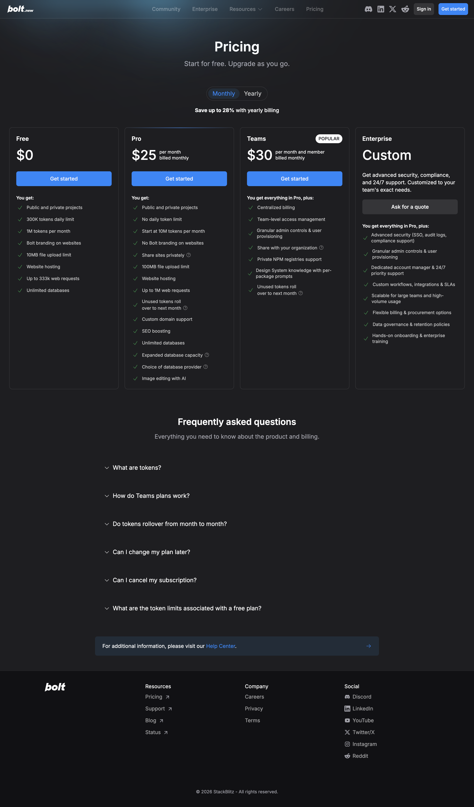
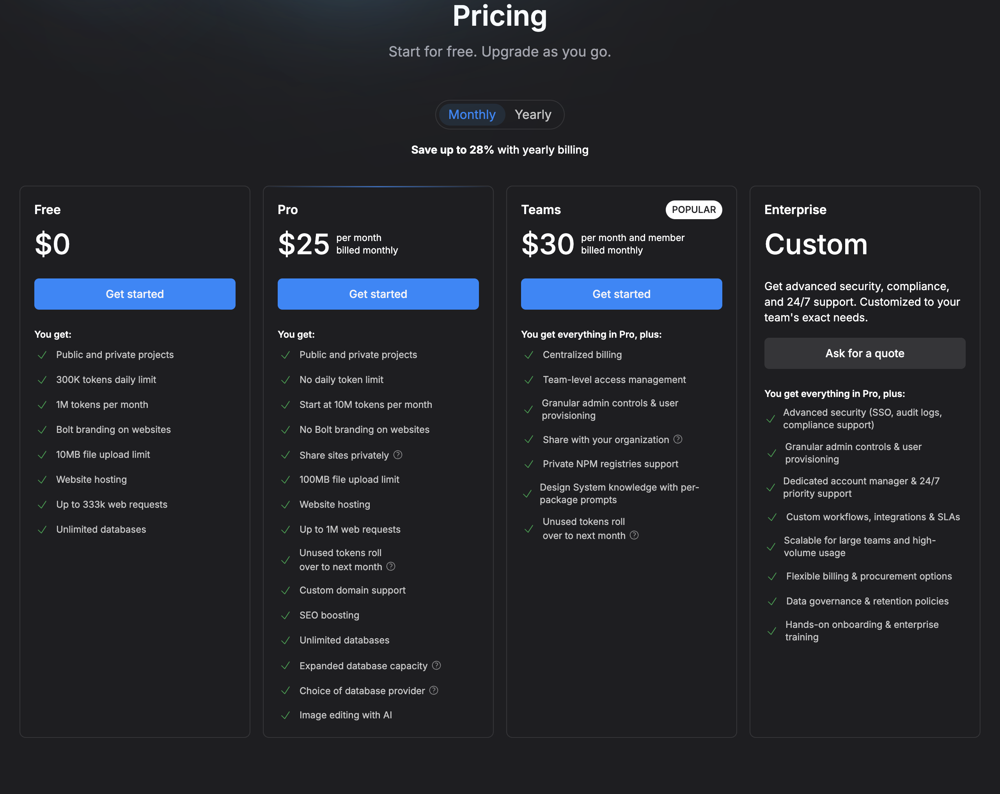
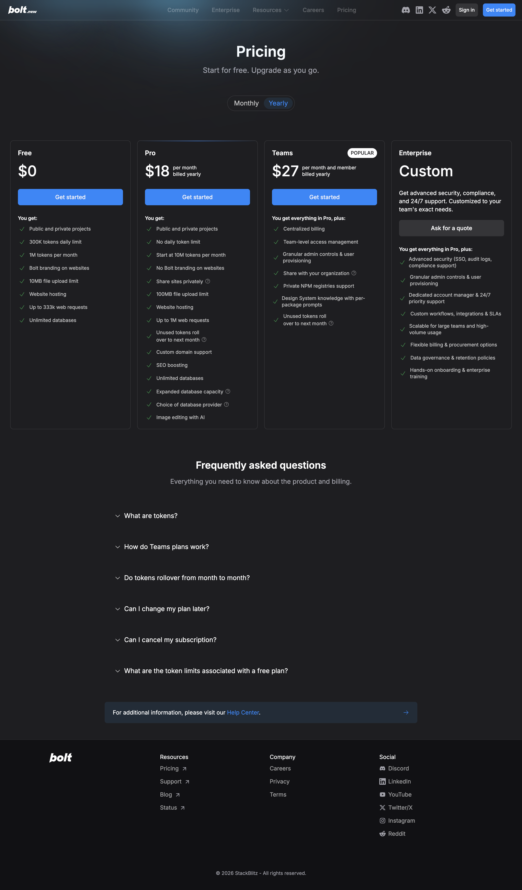
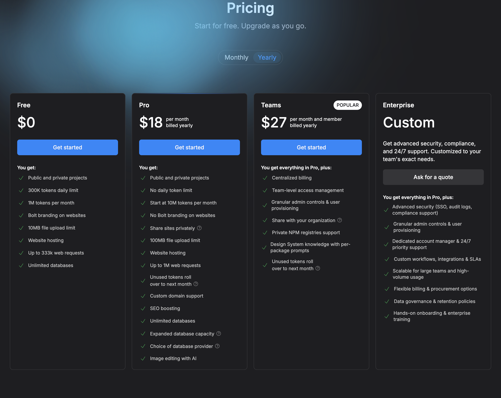
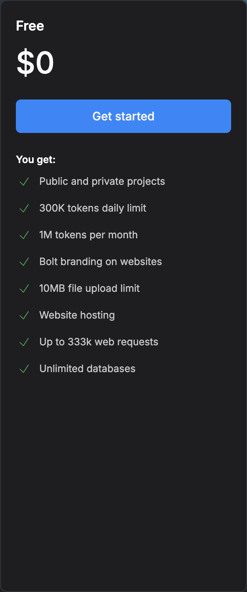
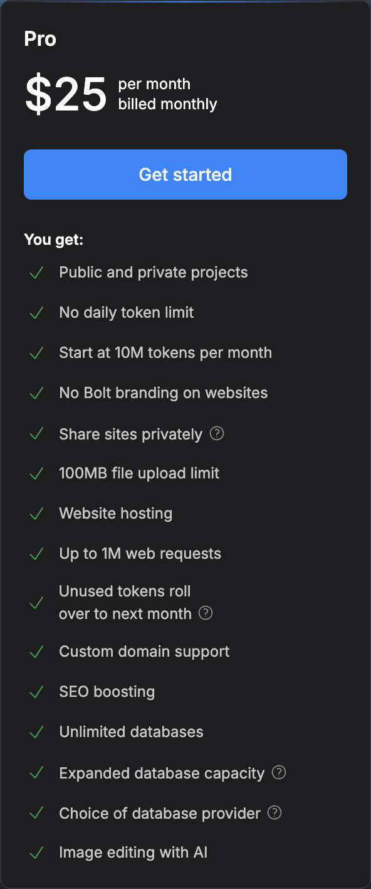
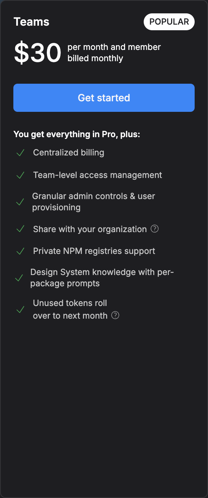
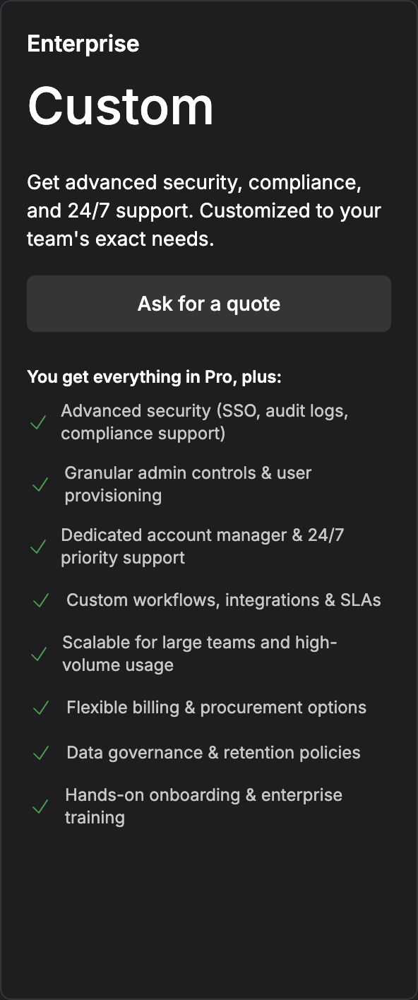

# Bolt — Pricing Model and Tiers

> Pricing page: https://bolt.new/pricing

## Pricing Model

Hybrid — token-based usage + flat monthly fee. Free tier provides a monthly token allowance with a daily cap. Paid tiers offer higher token limits with rollover. Teams tier is per-seat. Tokens are consumed per AI interaction and code generation.

## Tiers

| Tier | Price | Key Inclusions | Limits |
|------|-------|----------------|--------|
| Free | $0/mo | Public and private projects, 1M tokens/mo, Bolt branding on websites, 10MB file upload limit, website hosting, up to 333K web requests, unlimited databases | 300K tokens daily limit |
| Pro | $25/mo | No daily token limit, start at 10M tokens/mo, no Bolt branding, share sites privately, 100MB file upload limit, website hosting, up to 1M web requests, unused tokens roll over, custom domain support, SEO boosting, unlimited databases, expanded database capacity, choice of database provider, image editing with AI | — |
| Teams | $30/user/mo (billed monthly) | Everything in Pro + centralized billing, team-level access management, granular admin controls & user provisioning, share with your organization, private NPM registries support, design system knowledge with per-package prompts, unused tokens roll over | — |
| Enterprise | Custom | Everything in Pro + advanced security (SSO, audit logs, compliance support), granular admin controls & user provisioning, dedicated account manager & 24/7 priority support, custom workflows/integrations/SLAs, scalable for large teams and high-volume usage, flexible billing & procurement options, data governance & retention policies, hands-on onboarding & enterprise training | Contact sales |

### Screenshots

#### Monthly Pricing

#### Yearly Pricing

#### Tier Details

| Tier | Screenshot |
|------|------------|
| Free |  |
| Pro |  |
| Teams |  |
| Enterprise |  |

## Free Tier Limits

1M tokens per month with a 300K daily cap. Both public and private projects allowed (unlike Lovable which restricts free to public only). Bolt branding is displayed on hosted websites. 10MB file upload limit. Unlimited databases included. Up to 333K web requests per month. Website hosting provided.

## Enterprise Pricing

Custom pricing — requires contacting sales. Enterprise includes advanced security (SSO, audit logs, compliance support), granular admin controls and user provisioning, a dedicated account manager with 24/7 priority support, custom workflows/integrations/SLAs, scalable infrastructure for large teams and high-volume usage, flexible billing and procurement options, data governance and retention policies, and hands-on onboarding with enterprise training.

## Comparison to Forge

Bolt uses a token-based model (1M free, 10M Pro) vs. Forge's credit model. Bolt's Teams tier at $30/user/mo is competitive with Forge Teams.

Key differences:
- **Bolt advantage:** Database hosting included at all tiers (unlimited databases even on free). Private projects on free tier. SEO tools at Pro tier. Token rollover on paid plans.
- **Bolt disadvantage:** Token consumption can be unpredictable — heavy AI interactions burn through 10M tokens faster than expected. Bolt branding on free tier sites.
- **Forge advantage:** Better enterprise features, more mature deployment pipeline, superior generation quality, more predictable usage model.
- **Forge advantage:** Stronger collaboration and team management features at comparable price points.
