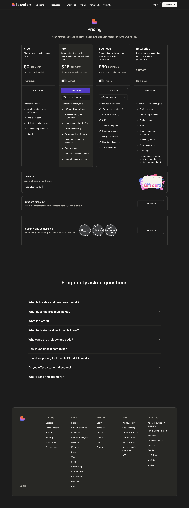
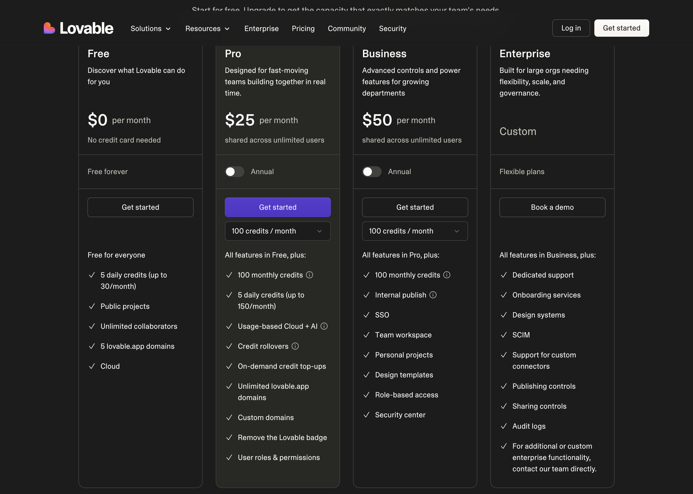
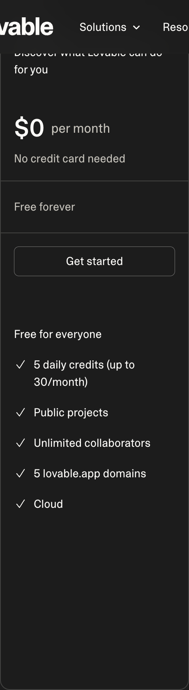
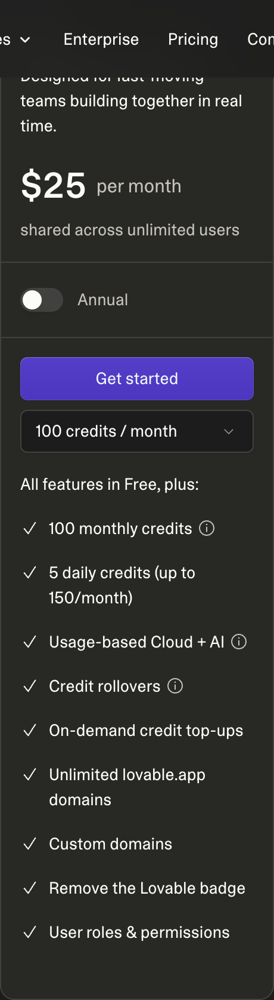
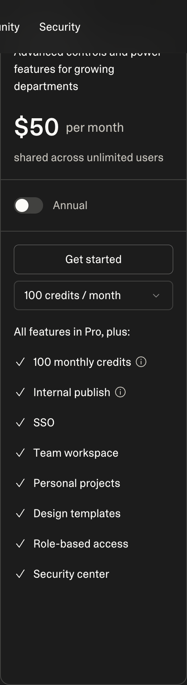
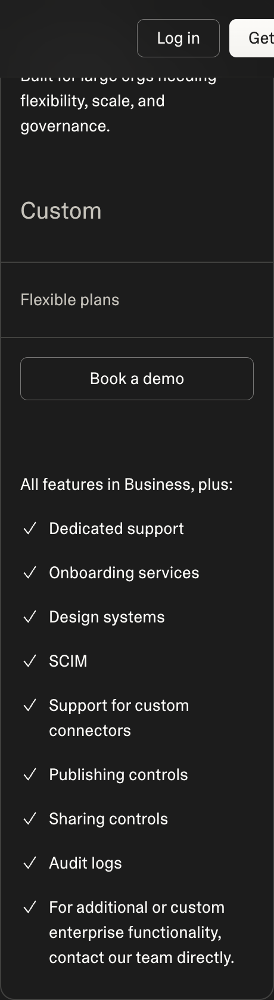

# Lovable — Pricing Model and Tiers

## Pricing Model

Hybrid — per-workspace flat fee (shared across unlimited users) + credit-based usage. Credits are consumed per generation. On-demand credit top-ups are available for additional usage beyond monthly allotments. Pricing is per workspace, not per seat, making it attractive for teams.

## Tiers

| Tier | Price | Key Inclusions | Limits |
|------|-------|----------------|--------|
| Free | $0/mo | 5 daily credits (up to 30/mo), public projects, unlimited collaborators, 5 lovable.app domains, Cloud hosting | Public projects only |
| Pro | $25/mo (shared across unlimited users) | 100 monthly credits, 5 daily credits (up to 150/mo), usage-based Cloud + AI, credit rollovers, on-demand credit top-ups, unlimited lovable.app domains, custom domains, remove Lovable badge, user roles & permissions | — |
| Business | $50/mo (shared across unlimited users) | All Pro features + 100 monthly credits, internal publish, SSO, team workspace, personal projects, design templates, role-based access, security center | — |
| Enterprise | Custom | All Business features + dedicated support, onboarding services, design systems, SCIM, support for custom connectors, publishing controls, sharing controls, audit logs | Contact sales |

### Screenshots

#### Monthly Pricing

#### Yearly Pricing

#### Tier Details

| Tier | Screenshot |
|------|------------|
| Free |  |
| Pro |  |
| Business |  |
| Enterprise |  |

## Free Tier Limits

5 credits per day (up to 30 per month). Public projects only — no private projects on the free plan. Unlimited collaborators can join a workspace. 5 lovable.app subdomains included. Cloud hosting is provided. No custom domains, no badge removal, no credit rollovers.

## Enterprise Pricing

Custom pricing, flexible plans. Requires contacting sales. Enterprise includes everything in Business plus dedicated support, onboarding services, design systems, SCIM provisioning, support for custom connectors, publishing controls, sharing controls, and audit logs. No public pricing is listed.

## Comparison to Forge

Lovable's Pro at $25/mo is shared across unlimited users (not per-seat), making it significantly cheaper for teams. However, credit limits (100/mo at Pro, 100/mo at Business) can be restrictive for heavy usage. The credit-based model means costs can spike with on-demand top-ups for power users.

Key differences:
- **Lovable advantage:** Per-workspace pricing means unlimited users at a flat rate. Lower entry price for teams.
- **Lovable disadvantage:** Credit limits can constrain heavy users. No public enterprise pricing.
- **Forge advantage:** Per-seat pricing with usage-based components gives more predictable per-user costs. More mature enterprise tier with published capabilities.
- **Forge advantage:** More generous generation limits at comparable price points.
