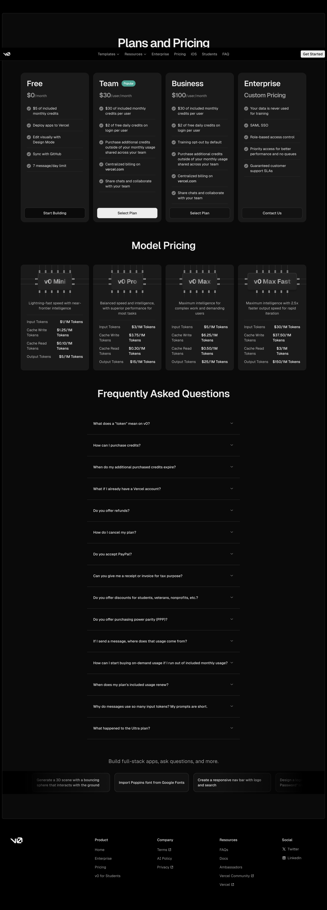
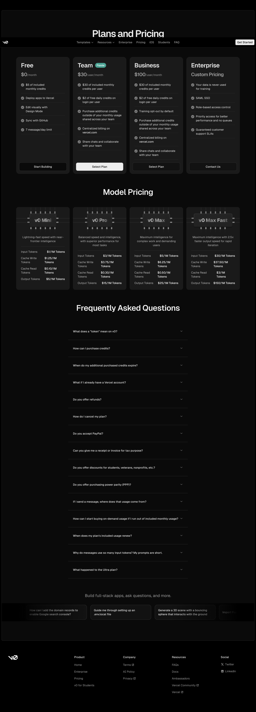
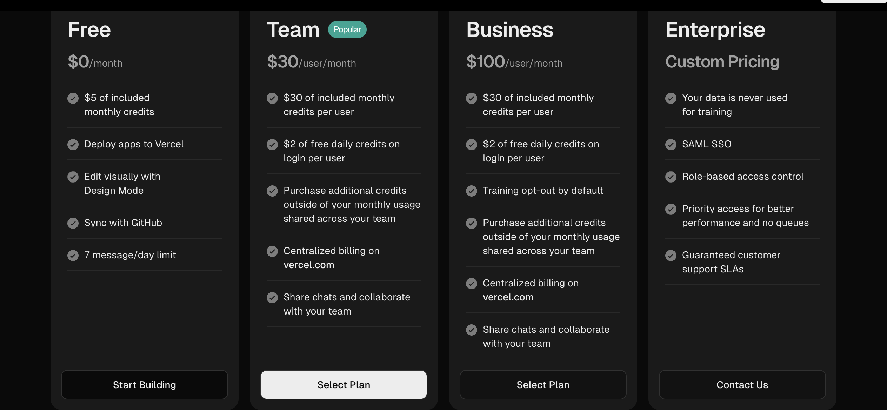
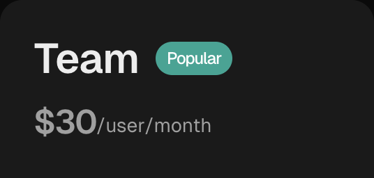
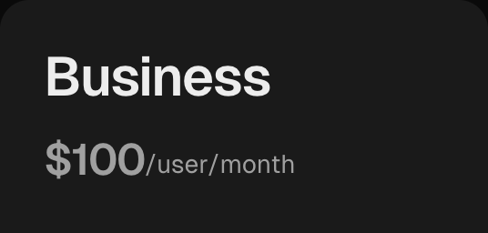
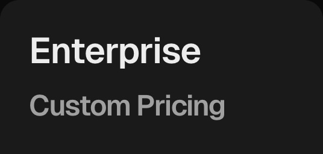

# v0 -- Pricing Analysis

**URL:** https://v0.dev/pricing
**Date captured:** 2026-03-23

## Model

Credit-based with per-seat pricing. Each user gets a monthly credit allowance plus daily bonus credits on login. Credits are consumed per generation/message. Additional credits can be purchased and shared across the team.

## Tiers

| Tier | Price | Key Inclusions | Limits |
|---|---|---|---|
| Free | $0/mo | $5 included monthly credits, deploy apps to Vercel, edit visually with Design Mode, sync with GitHub, 7 messages per day | 7 messages per day |
| Team | $30/user/mo | $30 included monthly credits per user, $2 free daily credits on login per user, purchase additional credits shared across team, centralized billing on vercel.com, share chats and collaborate | — |
| Business | $100/user/mo | $30 included monthly credits per user, $2 free daily credits on login per user, training opt-out by default, purchase additional credits shared across team, centralized billing on vercel.com, share chats and collaborate | — |
| Enterprise | Custom pricing | Data is never used for training, SAML SSO, role-based access control, priority access for better performance and no queues, guaranteed customer support SLAs | Contact sales |

### Screenshots

#### Monthly Pricing

#### Yearly Pricing

#### Tier Details

| Tier | Screenshot |
|------|------------|
| Free |  |
| Team |  |
| Business |  |
| Enterprise |  |

## Free Tier

$5 of included credits per month. 7 messages per day limit — the most restrictive daily cap among competitors. Deploy to Vercel included. GitHub sync available on free tier (unique advantage). Visual Design Mode editing included. No team features.

## Enterprise

Custom pricing — requires contacting sales. Data is never used for training (unlike lower tiers). SAML SSO included. Role-based access control. Priority access for better performance with no queues. Guaranteed customer support SLAs.

## Comparison

v0's pricing is significantly higher at the team level ($30/user/mo vs. Forge's lower starting price). The Business tier at $100/user/mo is the most expensive in the competitive set. The credit model ($30 included per user/mo) may not go far for heavy users, and the $2 daily login bonus creates an unusual incentive structure.

Key differences:
- **v0 advantage:** Tight Vercel/Next.js integration. GitHub sync on free tier. Visual Design Mode. Strong React component generation.
- **v0 disadvantage:** Highest per-seat pricing among competitors. Business tier at $100/user is 2-3x competitors. Frontend-only — no backend, database, or auth generation. 7 messages/day on free is very restrictive.
- **Forge advantage:** Full-stack generation (not just frontend). Better deployment pipeline. More generous free tier. Significantly lower per-seat pricing at Team and Business tiers.
- **Forge advantage:** More complete enterprise feature set at lower price points.
